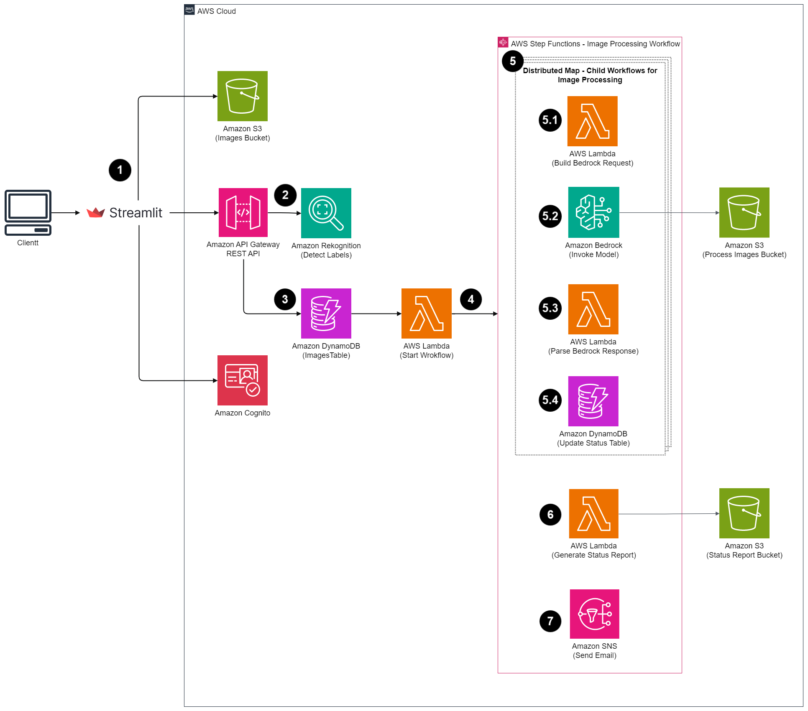

# Automate the process to change image background using Amazon Bedrock and AWS Step Functions

This repository showcases an automated method for the process of changing backgrounds in multiple images. By harnessing the capabilities of generative AI with Amazon Bedrock and the Amazon Titan Image Generator G1 model, combined with Step Functions, this solution efficiently generates images with the desired background. 

<p float="left">
  
  
</p>

> **Warning**
> This application is not ready for production use. It was written for demonstration and educational purposes. Review the [Security](#security) section of this README and consult with your security team before deploying this stack. No warranty is implied in this example.

> **Note**
> This architecture creates resources that have costs associated with them. Please see the [AWS Pricing](https://aws.amazon.com/pricing/) page for details and make sure to understand the costs before deploying this stack.

## How the application works



The solutions comprises of the below steps:

1.	A user uploads multiple images into an [Amazon Simple Storage Service (Amazon S3)](https://aws.amazon.com/s3/) via a Streamlit web applications. 
2. The Streamlit web application calls [AWS API Gateway](https://aws.amazon.com/api-gateway/) REST API Endpoint, it integrates with [Amazon Rekognition](https://aws.amazon.com/rekognition/) DetectLabels API which detects labels for each image.
3. Upon submission, the Streamlit web application updates [Amazon DynamoDB](https://aws.amazon.com/dynamodb/) table with image details.
4. The DynamoDB update triggers an [AWS Lambda function](https://aws.amazon.com/lambda/) which starts an [AWS Step Functions](https://aws.amazon.com/step-functions/) workflow.
5. The Step Functions workflow executes the below steps for each image.
   - Constructs a requet payload for the [Amazon Bedrock](https://aws.amazon.com/bedrock/) InvokeModel API.
   - Invokes Amazon Bedrock InvokeModel API action.
   - Parses image from the response and save it to an S3 location.
   - Updates status in DynamoDB table.
6. The Step Functions workflow then invokes a Lambda Function to generate a status report.
7. Finally, it sends email using [Amazon Simple Notification Services (Amazon SNS)](https://aws.amazon.com/sns/).

## Deployment instructions    

### Prerequisites

* [Create an AWS account](https://portal.aws.amazon.com/gp/aws/developer/registration/index.html) if you do not already have one and log in. The IAM user that you use must have sufficient permissions to make necessary AWS service calls and manage AWS resources.
* [AWS CLI](https://docs.aws.amazon.com/cli/latest/userguide/install-cliv2.html) installed and configured
* [Git Installed](https://git-scm.com/book/en/v2/Getting-Started-Installing-Git)
* [AWS Serverless Application Model](https://docs.aws.amazon.com/serverless-application-model/latest/developerguide/serverless-sam-cli-install.html) (AWS SAM) installed
* [Amazon Bedrock access setup](https://catalog.us-east-1.prod.workshops.aws/genai-on-aws/en-US/02-start-workshop/01-bedrock-setup) for Amazon Titan Image Generator G1 model
* [Python 3.9.9](https://www.python.org/downloads/release/python-390/) installed
* Port 8501 opened for Streamlit

### Deploy the application with AWS SAM

1. Clone the repo.
```bash
git clone https://github.com/aws-samples/automate-image-processing-with-amazon-bedrock
```

2.  Run the following command to prepare our serverlress application for deploying to the AWS Cloud. This command creates a `.aws-sam` directory that structures your application in a format and location that next step requries.
```bash
sam build
```

3. Now, package and deploy the SAM application. This deployment will be an interactive menu, the information to give the menu is below. Run the following command.
```bash
sam deploy --guided
```
- **Stack Name**: : `image-processing`
- **AWS Region**: `your current region (i.e. us-west-2, us-east-1)`
- **Parameter APIName**:  `leave as default`
- **Parameter S3BucketName**: `leave as default`
- **Parameter ImagePrefix**: `leave as default`
- **Parameter GeneratedImagePrefix**: `leave as default` 
- **Parameter StatusReportPrefix**: `leave as default` 
- **Parameter StatusReportURLExpiration**: `leave as default`
- **Parameter ImageProcessingWorkflowName**: `leave as default` 
- **Parameter NotificationSNSTopicName**: `leave as default`
- **Parameter NotificationEmail**: `Enter email address where you wish to receive notification after image processing is completed` 
- **Parameter BedrockModelId**: `leave as default` 
- **Parameter MaxConcurrency**: `leave as default` 
- **Confirm changes before deploy**: `N`
- **Allow SAM CLI IAM role creation**: `leave as default` 
- **Disable rollback**: `leave as default` 
- **Save arguments to configuration file**: `leave as default` 
- **SAM configuration file**: `leave as default`
- **SAM configuration environment**: `leave as default`

4. Verify the SAM template deployed successfully.  Also, copy the output values. You will use these details for testing.

5. An email confirmation request from **no-reply@sns.amazonaws.com** will be sent to your provided email address in the previous step to confirm the subscription to Amazon SNS. Please open the email and click on the **Confirm subscription link** to proceed.

### Create a user in the Amazon Cognito user pool
1. Navigate to the **Amazon Cognito console**.
2. Find the user pool with an ID matching the output provided by AWS SAM above.
3. Under Users, choose **Create user**.
4. Enter an email address and a password that adheres to the password requirements.
5. Choose **Create user**.

## Test

1. Go to the `/ui/` directory.

2. Update `config.py` with the values from AWS SAM output above.

3. Enter the following command to install all of the Python modules and packages listed in the `requirements.txt` from within `/ui/` directory
```shell
pip install -r requirements.txt
```

4. Launch the Streamlit app with following command from within `ui` directory.
```shell
streamlit run app.py
```

## Clean up

1. Go to the root directory.

2. Run the following command to empty the image bucket. Make sure to replace the `<image-bucket-name>` with the bucket name you copied earlier from AWS SAM output. 
```shell
aws s3 rm s3://<image-bucket-name> --recursive
```

3. Run the following command to delete the SAM template.
```shell
sam delete --stack-name image-processing --no-prompts 
```

## Security

See [CONTRIBUTING](CONTRIBUTING.md#security-issue-notifications) for more information.

## License

This library is licensed under the MIT-0 License. See the LICENSE file.

## DISCLAIMER

The solution architecture sample code is provided without any guarantees, and you're not recommended to use it for production-grade workloads. The intention is to provide content to build and learn. Be sure of reading the licensing terms.